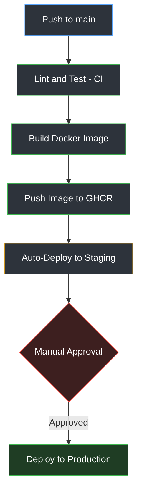

# From Zero to CI/CD: A Hands-On GitHub Actions Tutorial

This repo is a practice project that walks through building a real CI/CD pipeline from scratch using GitHub Actions. It starts with nothing and ends with a pipeline that tests the code, builds a Docker image, and deploys it through staging and production with a manual approval step.

No prior CI/CD experience needed. Just follow the steps in order.

## What you'll end up with



## Tech stack

| Tool | Role |
|---|---|
| **Git** | Version control. Tracks every code change locally. |
| **GitHub** | Remote repo hosting, where the code and pipeline live. |
| **GitHub Actions** | CI/CD engine. Runs the pipeline automatically on every push. |
| **YAML** | The language the pipeline (`ci-cd.yml`) is written in. |
| **Python** | The application language (`app.py`). |
| **pytest** | Testing framework. Runs `test_app.py`. |
| **flake8** | Linter. Checks code style before tests run. |
| **Docker** | Packages the app into a portable container image. |
| **GitHub Container Registry (GHCR)** | Where the built Docker image is stored and versioned. |
| **GitHub Environments** | Defines `staging` and `production` targets with approval rules. |

## Project structure

```
cicd-practice/
├── app.py                       # the actual application code
├── test_app.py                  # pytest tests for app.py
├── requirements.txt             # Python dependencies
├── Dockerfile                   # how to package the app into a container image
└── .github/
    └── workflows/
        └── ci-cd.yml             # the pipeline definition
```

---

## Step 0: The code

`app.py`, a few small functions:

```python
def add(a, b):
    return a + b

def divide(a, b):
    if b == 0:
        raise ValueError("Cannot divide by zero")
    return a / b

def is_even(n):
    return n % 2 == 0
```

`test_app.py`, tests for it using `pytest`:

```python
import pytest
from app import add, divide, is_even

def test_add():
    assert add(2, 3) == 5

def test_divide():
    assert divide(10, 2) == 5
    with pytest.raises(ValueError):
        divide(10, 0)

def test_is_even():
    assert is_even(4) is True
```

`requirements.txt`:
```
pytest==8.3.3
flake8==7.1.1
```

---

## Step 1: Check everything works locally, before touching CI

Never trust a pipeline to catch something you haven't checked yourself first.

```bash
python -m venv venv
source venv/bin/activate        # Windows: venv\Scripts\activate
pip install -r requirements.txt

flake8 . --max-line-length=100  # linter, prints nothing if clean
pytest -v                       # tests, should show 3 passed
```

If both pass locally, you're ready to automate them.

---

## Step 2: CI, automatically lint and test on every push

Create `.github/workflows/ci.yml`:

```yaml
name: CI

on:
  push:
    branches: [ main ]
  pull_request:
    branches: [ main ]

jobs:
  build-and-test:
    runs-on: ubuntu-latest

    steps:
      - name: Checkout code
        uses: actions/checkout@v4

      - name: Set up Python
        uses: actions/setup-python@v5
        with:
          python-version: "3.11"

      - name: Install dependencies
        run: |
          python -m pip install --upgrade pip
          pip install -r requirements.txt

      - name: Lint with flake8
        run: flake8 . --max-line-length=100

      - name: Run tests
        run: pytest -v
```

**How it works:**
- `on:` declares the trigger. GitHub runs this automatically on every push or PR to `main`. No cron job, no manual step, it's event-driven.
- Any `.yml` file inside `.github/workflows/` is auto-detected as a workflow. That folder path is the convention GitHub looks for.
- `runs-on: ubuntu-latest` means every run happens on a brand-new, blank virtual machine. Nothing persists between runs, which is why every step re-installs everything.
- `uses:` runs a pre-built action (someone else's packaged code). `run:` executes a raw shell command yourself.
- `actions/checkout@v4` copies your repo code onto the blank VM. Without it, the VM has no code to test.

Push it:
```bash
git add .github/workflows/ci.yml
git commit -m "add CI pipeline"
git push
```

Go to the **Actions** tab on GitHub. You'll see the run appear automatically and go green.

### Prove it actually works: break something on purpose

Change `add` to `return a - b`, push, and watch the `Run tests` step fail **red** in the Actions log. Then fix it back and push again, watch it turn green. This is the core CI habit: nothing merges silently broken.

---

## Step 3: CD, build and ship a Docker image

Add a `Dockerfile`:

```dockerfile
FROM python:3.11-slim

WORKDIR /app

COPY requirements.txt .
RUN pip install --no-cache-dir -r requirements.txt

COPY app.py .

CMD ["python", "app.py"]
```

- `FROM` starts from a pre-built base image instead of an empty OS.
- `WORKDIR /app` sets the working folder inside the container.
- Dependencies are copied and installed before the app code. Docker caches each step, so if only your code changes, it skips reinstalling dependencies on the next build.
- `CMD` is what runs by default when the container starts.

Rename `ci.yml` to `ci-cd.yml` and add a `deploy` job after `build-and-test`:

```yaml
  deploy:
    needs: build-and-test
    if: github.ref == 'refs/heads/main' && github.event_name == 'push'
    runs-on: ubuntu-latest
    permissions:
      contents: read
      packages: write

    steps:
      - name: Checkout code
        uses: actions/checkout@v4

      - name: Log in to GitHub Container Registry
        uses: docker/login-action@v3
        with:
          registry: ghcr.io
          username: ${{ github.actor }}
          password: ${{ secrets.GITHUB_TOKEN }}

      - name: Build and push image
        uses: docker/build-push-action@v6
        with:
          context: .
          push: true
          tags: ghcr.io/${{ github.repository }}:${{ github.sha }}
```

- `needs: build-and-test` is the actual quality gate. If tests fail, this job never runs, and no image ever gets built.
- `if:` limits this to real merges on `main`, not every PR.
- `secrets.GITHUB_TOKEN` is auto-generated by GitHub for every run, no setup needed, and it expires right after.
- `github.sha` is the commit hash, used as the image tag so every build is uniquely traceable and never overwrites a previous one.

### The lowercase gotcha

Docker registries require **all-lowercase** repository names. If your GitHub username has capital letters (for example `AdarshVajpayee`), the build fails with:

```
ERROR: failed to build: invalid tag "...": repository name must be lowercase
```

Fix: add a step to lowercase the repo name before it's used in the tag.

```yaml
      - name: Lowercase repo name
        run: echo "REPO_LC=${GITHUB_REPOSITORY,,}" >> $GITHUB_ENV

      - name: Build and push image
        uses: docker/build-push-action@v6
        with:
          context: .
          push: true
          tags: ghcr.io/${{ env.REPO_LC }}:${{ github.sha }}
```

`${GITHUB_REPOSITORY,,}` is bash syntax. The `,,` lowercases the whole string. `>> $GITHUB_ENV` saves it so later steps in the same job can reference it as `env.REPO_LC`.

Push, then check your repo's **Packages** tab. The image should be listed there, tagged with the commit SHA.

---

## Step 4: Staging, manual approval, production

Add two more jobs after `deploy`:

```yaml
  deploy-staging:
    needs: deploy
    runs-on: ubuntu-latest
    environment: staging

    steps:
      - name: "Deploy to staging"
        run: echo "Deploying image ${{ github.sha }} to STAGING"

  deploy-production:
    needs: deploy-staging
    runs-on: ubuntu-latest
    environment: production

    steps:
      - name: "Deploy to production"
        run: echo "Deploying image ${{ github.sha }} to PRODUCTION"
```

The `environment:` line is what turns a job into a "deployment" that GitHub can attach protection rules to.

**Set up the gate on GitHub:**
1. Repo, then Settings, then Environments, then New environment. Name it `staging` and save (no rules needed).
2. New environment again. Name it `production`, open it, check **Required reviewers**, add yourself and/or a teammate, then save protection rules.

To add someone else as a reviewer, they need at least Read access to the repo first, under Settings, then Collaborators, then Add people.

Push. Watch the Actions tab: `deploy-staging` runs automatically, then `deploy-production` pauses with a **Review deployments** button. Any listed reviewer can click **Approve and deploy** to let it proceed.

---

## Recap: what each concept maps to

| Concept | What it means |
|---|---|
| Trigger (`on:`) | What event starts the pipeline |
| Job | An independent unit of work, runs on its own fresh VM |
| Step | One action or command inside a job |
| `needs:` | Makes one job wait for another to succeed first |
| Artifact | The thing CD produces, here a Docker image (similar to a `.jar` in Java) |
| Environment | A named deployment target that can have approval rules attached |
| Secret | An encrypted value (API key, token) injected at runtime, never hardcoded |

---

## Try it yourself

1. Fork or clone this repo
2. Follow steps 1 through 4 above, in order
3. Break a test on purpose and watch CI catch it
4. Trigger a full pipeline run and approve your own production deploy

If you get stuck, read the error messages slowly before assuming something's broken at a deeper level. They're usually pretty literal.
